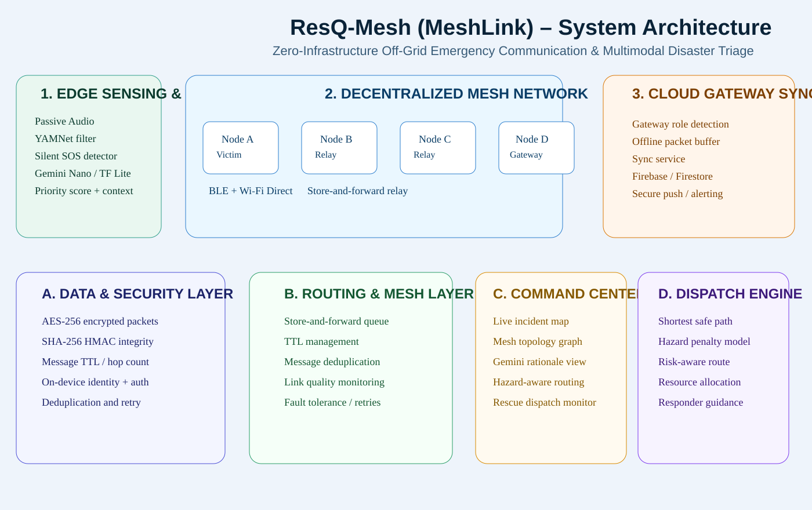
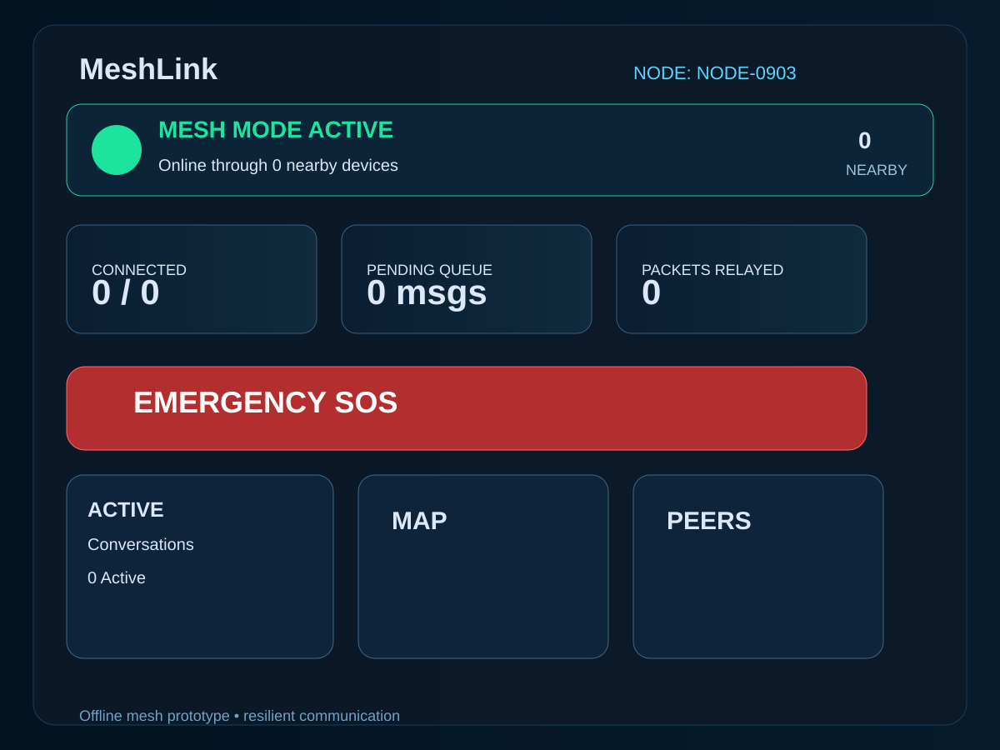
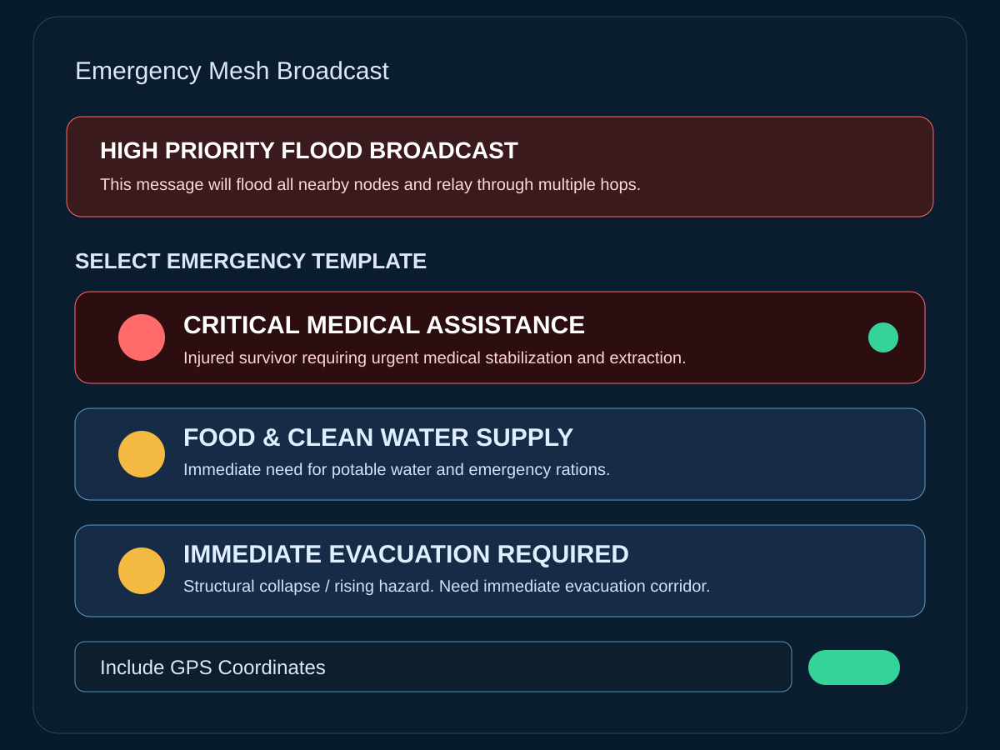
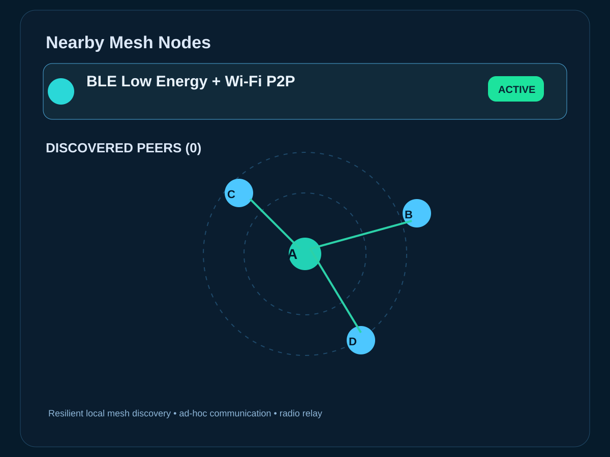

# ResQ-Mesh (MeshLink)

<div align="center">

[](https://flutter.dev)
[](https://developer.android.com)
[](https://www.bluetooth.com)
[](https://)
[](https://)

</div>

<h2 align="center">Zero-Infrastructure Off-Grid Emergency Communication & Multimodal Disaster Triage</h2>

## Problem Statement

Natural disasters regularly destroy cellular infrastructure, leaving victims isolated and rescue teams blind to critical local ground truth. In the first minutes after a collapse, flood, fire, or blackout, communication networks fail just when they are needed most.

## Solution

ResQ-Mesh creates an ad-hoc, off-grid peer-to-peer mesh network across standard smartphones and low-power edge nodes to relay life-critical SOS payloads and automate multimodal rescue triage. It turns nearby devices into a resilient communication layer when infrastructure is unavailable.

---

## Why it matters

- Victims lose mobile connectivity exactly when emergency signals matter most
- Rescue teams lack real-time, local incident awareness
- Conventional systems depend on the infrastructure that has already failed
- A decentralized mesh can preserve life-critical information and local situational intelligence

---

## Core Architecture

### 1. P2P Mesh Layer
Uses decentralized routing over BLE and Wi‑Fi Direct to hop encrypted SOS packets across devices without cellular connectivity.

### 2. Edge Audio & Vitals Triage
Runs on-device acoustic analysis and sensor-based inference to classify distress sounds such as cries, structural collapse patterns, and tapping, then assigns priority scores.

### 3. Dynamic Topology Visualizer
Edge-gateway syncs network topology to a central command dashboard once any single node reaches an active network link.

### 4. Adaptive Resource Dispatch
Graph optimization dynamically computes the safest rescue paths, avoiding mapped hazard zones and routing assistance to the highest-priority location.

---

## System Architecture Diagram

<p align="center">
  
</p>

### Tech modules used

- BLE / Wi‑Fi Direct
- Store-and-Forward Mesh Routing
- AES-256 Encryption
- SHA-256 Integrity Validation
- Gemini Nano / On-device AI
- TensorFlow Lite / MediaPipe-style audio inference
- Firebase Firestore sync
- React command dashboard
- Flutter mobile application
- Graph-based hazard-aware routing

---

## Product Workflow

<table>
  <tr>
    <td><strong>1. Sensing</strong><br>Victim device captures audio, vibration, or SOS input.</td>
    <td><strong>2. Triage</strong><br>Edge ML / on-device inference computes priority and context.</td>
    <td><strong>3. Relay</strong><br>Encrypted packet hops through nearby phones using BLE + Wi‑Fi Direct.</td>
    <td><strong>4. Dispatch</strong><br>Gateway syncs to the command center and safe route is computed.</td>
  </tr>
</table>

### Workflow flow

1. Victim device captures emergency signal input
2. Edge triage runs local analysis and computes priority score
3. Encrypted SOS packet is generated with metadata and location context
4. Packet is relayed across nearby phones via P2P mesh routing
5. Gateway node syncs valid incidents to the backend when connectivity returns
6. Rescue command center visualizes topology, risk, and safe dispatch route

---

## Hackathon Demo Flow

### Demo narrative

> “Natural disasters destroy cellular infrastructure. Victims are isolated, and rescue teams are blind to local ground truth. ResQ-Mesh restores local communication through an ad-hoc mesh network built across nearby smartphones and edge devices.”

> “A victim emits a distress signal, the device performs on-device triage, and the message is relayed automatically through nearby nodes until it reaches a gateway, which then syncs to the command center.”

---

## App Screenshots

### Home dashboard

<p align="center">
  
</p>

### Emergency broadcast screen

<p align="center">
  
</p>

### Nearby mesh nodes

<p align="center">
  
</p>

---

## Implementation Highlights

- Offline-first mobile mesh application
- Multi-node relay concept for emergency coordination
- Secure stored-and-forward SOS transmission
- Local triage logic and emergency classification
- Real-time command visualization for concept validation
- Designed for hackathon and prototype presentation

---

## Repository Structure

```text
mesh/
├── mobile_app/                  # Flutter app for Android prototype
├── web_dashboard/               # React command dashboard
├── docs/screenshots/             # Demo screenshots and architecture visuals
├── README.md                    # Project overview and hackathon deck
├── DEMO_GUIDE.md                # Live demo presentation flow
├── PITCH_DECK.md                # Investor / judge pitch narrative
├── mobile_app/README.md         # Mobile app setup guide
└── .gitignore
```

---

## Quick Start

### Install dependencies

```bash
cd mobile_app
flutter pub get
```

### Run locally

```bash
flutter run
```

### Build APK for device testing

```bash
flutter build apk --debug
```

### Install on a connected Android device

```bash
adb devices
adb -s <device_serial> install -r build/app/outputs/flutter-apk/app-debug.apk
```

### Launch the dashboard

```bash
cd ../web_dashboard
npm install
npm run dev
```

---

## Live Demo Setup

For a 3-phone showcase:

- Phone A: Victim / sender node
- Phone B: Relay node
- Phone C: Gateway / receiver node

Recommended flow:

1. Install app on all three phones
2. Turn on Airplane Mode on each device
3. Keep Bluetooth enabled
4. Place phones close together
5. Trigger emergency broadcast or SOS from Phone A
6. Show relay behavior on Phone B
7. Show gateway sync or dashboard update on Phone C

---

## Future Roadmap

- Real Bluetooth Nearby Connections integration
- Edge AI classification refinement
- More robust security and encrypted packet routing
- Improved topology analytics and rescue pathing
- Production APK signing and deployment workflow

---

## Final Statement

ResQ-Mesh is a practical, demonstrable emergency resilience platform that turns everyday smartphones into a local, autonomous rescue network. It combines decentralized communication, on-device triage, and topology-aware dispatch to help bridge the critical window between disaster and rescue.

<p align="center">
  <b>Built for hackathon demos, startup showcases, and real-world resilience experiments.</b>
</p>
